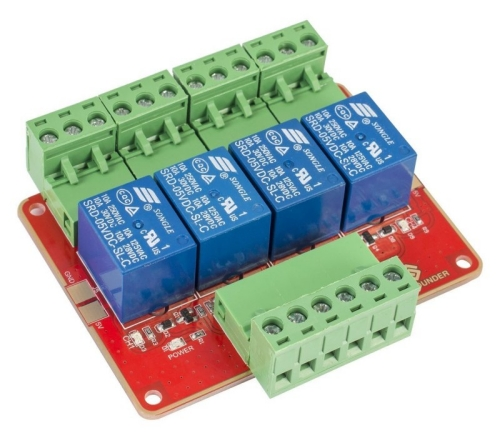

# Scripts

Scripts connecting the CitizenWatt Application, Ethereum and a relay, to switch energy providers. _work in progress_ 

## Description

2 scripts are present (for [proto v0.2](https://github.com/DAISEE/Prototypes#prototype-v02)):
* **server_relay.py** : script for the Raspberry Pi controlling the relay. The others nodes interact with this Raspberry Pi through sockets.  
tested with [4-Channel Relay from Sunfounder](http://wiki.sunfounder.cc/index.php?title=4-Channel_High_Level_Trigger_Relay), directly connected to a Raspberry Pi
.   

* **client_interaction.py** : script for the other "nodes" (on which the CitizenWatt App and Ethereum are running).  
  
(_version for proto v0.1 : see [release](https://github.com/DAISEE/Scripts/releases/tag/v0.1-beta)_)

## Prerequisites

* [web3.py](https://github.com/pipermerriam/web3.py)
* [PyYAML](http://pyyaml.org/)
