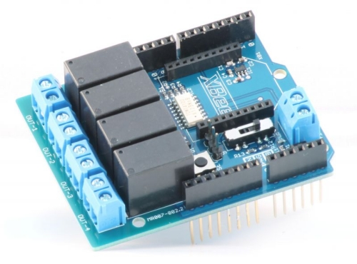

# Scripts
Scripts connecting the CitizenWatt Application, Ethereum and a relay.

## Description 
Two versions are present :
- [proto v0.1](https://github.com/DAISEE/Prototypes#prototype-v01) : **scripts/dz_interaction.py**    
tested with an Arduino Uno and a [MicroBot Relay Shield V2](http://www.microbot.it/en/product/87/Relay-Shield-V2.html), it uses the following sketch : [arduino-relay.ino](arduino-relay/arduino-relay.ino)  
  
  
- [proto v0.2](https://github.com/DAISEE/Prototypes#prototype-v02) : **scripts/dz_interaction_rpi.py** ()  
tested with [4-Channel Relay from Sunfounder](http://wiki.sunfounder.cc/index.php?title=4-Channel_High_Level_Trigger_Relay), directly connected to a dedicated Raspberry Pi. The others nodes interact with this Raspberry Pi through sockets.    

  
  
_work in progress_ 
